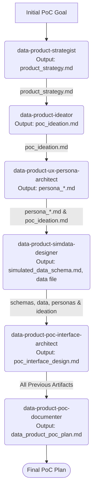

+++
# --- Basic Metadata (Required for Manager Squad Composition KB Reference) ---
id = "KB-REF-MDP-DP-SQUAD-COMP-V1" # MDP for Manager-Data-Product, DP for Data Product squad
title = "Manager Data Product: Data Product Design Squad Composition & Roles"
context_type = "kb_reference" # Fixed type for KB reference files
scope = "Defines the members, roles, sequence, and key I/O for the 'Data Product Design Squad', managed by the 'Manager Data Product' (manager-data-product) mode."
target_audience = ["manager-data-product"] # The Manager mode itself
granularity = "detailed_reference"
status = "active"
last_updated = "{{YYYYMMDD}}" # Placeholder for date of last update
version = "1.0" # Version of this squad composition document
tags = ["kb", "reference", "manager", "manager-data-product", "squad-composition", "data-product-design-squad", "workflow-definition"]
related_context = [
    ".roo/commander/modes/manager-data-product/manager-data-product.mode.md",
    ".roo/commander/modes/manager-data-product/kb/procedures/01-main-data-product-orchestration-flow.md" # The flow that uses this
    # Add links to each data-product-* squad member's .mode.md file
    ".roo/commander/modes/data-product-strategist/data-product-strategist.mode.md",
    ".roo/commander/modes/data-product-ideator/data-product-ideator.mode.md",
    ".roo/commander/modes/data-product-ux-persona-architect/data-product-ux-persona-architect.mode.md",
    ".roo/commander/modes/data-product-simdata-designer/data-product-simdata-designer.mode.md",
    ".roo/commander/modes/data-product-poc-interface-architect/data-product-poc-interface-architect.mode.md",
    ".roo/commander/modes/data-product-poc-documenter/data-product-poc-documenter.mode.md"
]
template_schema_doc = ".roo/commander/templates/modes/manager/kb/template_02_manager_squad_composition.README.md"

# --- Reference Specific Fields (Optional) ---
primary_workflow_name = "Data Product PoC Design Lifecycle"
overall_squad_goal = "To produce a comprehensive Data Product Proof of Concept (PoC) Plan based on initial user requirements and strategic objectives."
+++

# Manager Data Product: Data Product Design Squad Composition & Roles

## 1. Objective

This document defines the composition, roles, typical operational sequence, and key input/output artifacts for the **Data Product Design Squad**. This squad is orchestrated by the **`manager-data-product`** mode to achieve the goal of designing a Data Product Proof of Concept (PoC).

This reference is critical for `manager-data-product` to correctly plan and delegate MDTM sub-tasks to its squad members as detailed in its main orchestration flow (`kb/procedures/01-main-data-product-orchestration-flow.md`).

## 2. Squad Overview

*   **Squad Name:** Data Product Design Squad
*   **Managing Mode:** `manager-data-product`
*   **Primary Goal:** To collaboratively define and document all necessary components for a Data Product PoC, culminating in a `data_product_poc_plan.md`.

## 3. Squad Members & Workflow Sequence

---
### Phase 1: Strategy Definition
*   **Squad Member Role:** Data Product Strategist
*   **Mode Slug:** `data-product-strategist`
*   **Primary Responsibility in this Phase:** To define the vision, business objectives, target audience, value proposition, and strategic alignment for the Data Product PoC.
*   **Typical Input Artifact(s) for this Phase:**
    *   Initial PoC Goal/User Brief (from `manager-data-product`'s primary MDTM task).
    *   Active `RooComSessionID` and session path for context.
*   **Key Output Artifact(s) from this Phase:**
    *   `product_strategy_v1.md` - Contains the comprehensive product strategy.
    *   Target Location: `[ActiveSessionPath]/artifacts/design_outputs/[ProductName]/`

---
### Phase 2: Ideation & Scoping
*   **Squad Member Role:** Data Product Ideator
*   **Mode Slug:** `data-product-ideator`
*   **Primary Responsibility in this Phase:** To translate the defined strategy into concrete PoC features, define the PoC scope (in/out), and outline initial data requirements and success metrics.
*   **Typical Input Artifact(s) for this Phase:**
    *   Path to `product_strategy_v1.md` (from Phase 1).
*   **Key Output Artifact(s) from this Phase:**
    *   `poc_ideation_v1.md` - Details the PoC scope, features, and initial considerations.
    *   Target Location: `[ActiveSessionPath]/artifacts/design_outputs/[ProductName]/`

---
### Phase 3: UX Persona Development
*   **Squad Member Role:** Data Product UX Persona Architect
*   **Mode Slug:** `data-product-ux-persona-architect`
*   **Primary Responsibility in this Phase:** To develop 1-2 detailed key user personas relevant to the PoC, based on the strategy and ideation.
*   **Typical Input Artifact(s) for this Phase:**
    *   Path to `product_strategy_v1.md`.
    *   Path to `poc_ideation_v1.md`.
*   **Key Output Artifact(s) from this Phase:**
    *   `persona_[RoleName1]_v1.md`, `persona_[RoleName2]_v1.md` (one or more persona files).
    *   Target Location: `[ActiveSessionPath]/artifacts/design_outputs/[ProductName]/`

---
### Phase 4: Simulated Data Design
*   **Squad Member Role:** Data Product Simulated Data Designer
*   **Mode Slug:** `data-product-simdata-designer`
*   **Primary Responsibility in this Phase:** To define a schema for simulated data needed for the PoC and describe/generate sample data relevant to the personas and PoC features.
*   **Typical Input Artifact(s) for this Phase:**
    *   Path to `poc_ideation_v1.md` (for data requirements).
    *   Paths to `persona_*.md` files (for user context).
*   **Key Output Artifact(s) from this Phase:**
    *   `simulated_data_schema_v1.md` - Documents the data schema.
    *   `simulated_data_v1.csv` (or `.json`) - The sample data file.
    *   Target Location: `[ActiveSessionPath]/artifacts/design_outputs/[ProductName]/`

---
### Phase 5: Conceptual Interface Design
*   **Squad Member Role:** Data Product PoC Interface Architect
*   **Mode Slug:** `data-product-poc-interface-architect`
*   **Primary Responsibility in this Phase:** To design a conceptual user interface (e.g., dashboard wireframes, report layouts) for the PoC based on personas, data, and scope.
*   **Typical Input Artifact(s) for this Phase:**
    *   Paths to `persona_*.md` files.
    *   Path to `simulated_data_schema_v1.md` (and potentially the data file for understanding).
    *   Path to `poc_ideation_v1.md` (for features to be surfaced).
*   **Key Output Artifact(s) from this Phase:**
    *   `poc_interface_design_v1.md` - Describes the conceptual UI.
    *   Target Location: `[ActiveSessionPath]/artifacts/design_outputs/[ProductName]/`

---
### Phase 6: PoC Plan Consolidation
*   **Squad Member Role:** Data Product PoC Documenter & Planner
*   **Mode Slug:** `data-product-poc-documenter`
*   **Primary Responsibility in this Phase:** To synthesize all previously created design artifacts into a single, comprehensive Data Product PoC Plan document.
*   **Typical Input Artifact(s) for this Phase:**
    *   Path to `product_strategy_v1.md`.
    *   Path to `poc_ideation_v1.md`.
    *   Paths to all `persona_*.md` files.
    *   Path to `simulated_data_schema_v1.md`.
    *   Path to `poc_interface_design_v1.md`.
*   **Key Output Artifact(s) from this Phase:**
    *   `data_product_poc_plan_v1.md` - The final, consolidated PoC Plan.
    *   Target Location: `[ActiveSessionPath]/artifacts/design_outputs/[ProductName]/`

---

## 4. Artifact Flow Summary (Conceptual)

## 5. Notes on Orchestration

*   The `manager-data-product` mode will create a separate MDTM sub-task for each phase, assigning it to the designated squad member.
*   The `output_artifacts` of one phase (e.g., `product_strategy_v1.md`) become the `input_artifacts` for the next phase's sub-task.
*   All squad member output artifacts are stored within the active session's `artifacts/design_outputs/[ProductName]/` directory, with paths recorded in their respective MDTM sub-tasks.

This document is the definitive reference for `manager-data-product` regarding the composition, roles, and workflow of its Data Product Design Squad.